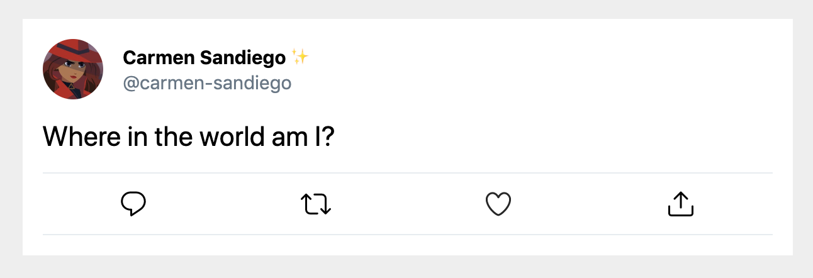

# Workshop: Whimsical Animation

Today, we'll build an over-the-top "like" button, similar to the one found on Twitter.com:


While it all happens quickly, there's actually quite a lot going on here! Specifically, we will need 3 distinct animations:

- A pink circle needs to rise up and "pop"
- The heart needs to swell up, in a springy motion
- Confetti particles need to burst out

We'll build them in turn :)

Before we get to the fun stuff, we have a some work to do. It looks like the workshop doesn't quite have everything we'd expect to see in a tweet. Specifically, the following things are missing:

- The date and time of the tweet
- The # of retweets
- The # of likes

Additionally, nothing actually works yet; we can't "like" or "retweet" the tweet!

This workshop is focused entirely on front-end UI stuff, so we don't need to worry about "real" data, but we do need to make sure that are components are well-architected.

## Starting point

Inside the workshop, you'll find a basic React app that loads the following Tweet:



Take a few moments to investigate the provided folders and files. This project comes with a decent amount of scaffolding. Be sure to check out the various components (and the files within these directories):

- LikeButton
- Tweet
- UnstyledButton

### Component directory structure

This project uses a slightly different directory structure: each component gets its own folder in `src/components`. It looks like this:

```
src
└── components
  └── SomeComponent
    ├── index.js
    └── SomeOtherComponent.js
```

```js
import Tweet from "../Tweet";
```

This import points to the _directory_, `src/components/Tweet`. When you point an import at a directory, it looks for an `index.js` inside; this is part of how Node.js module resolution works.

The `index.js` contains the component named `Tweet`. This format is useful when a component has at least one child component to itself. We can keep them in the same folder. It helps to keep our components more organized.

---

## Exercise 1: Setting up Context

Open this exercise file: [exercise-1.md](__workshop/exercise-1.md)

## Exercise 2: Adding the date

Open this exercise file: [exercise-2.md](__workshop/exercise-2.md)

## Exercise 3: Adding mutable data to state

Open this exercise file: [exercise-3.md](__workshop/exercise-3.md)

## Exercise 4: Adding "Like" functionality

Open this exercise file: [exercise-4.md](__workshop/exercise-4.md)

## Exercise 5: Popping the circle

Open this exercise file: [exercise-5.md](__workshop/exercise-5.md)

---

<center>🟡 - Minimally complete workshop (75%) - 🟡</center>

---

## Exercise 6: Swelling the heart

Open this exercise file: [exercise-6.md](__workshop/exercise-6.md)

---

<center>🟢 - Complete workshop (100%) - 🟢</center>

---

## Exercise 7: Animating the Retweet Button

Try animating the Retweet button in a similar, or totally different way!

## Exercise 8: Throwing the Particles ✨

Open this exercise file: [exercise-8.md](__workshop/exercise-8.md)

## Exercise 9: Taking whimsy to past projects

This workshop is all about whimsy. How can we apply these lessons to previous workshops?

Some ideas:

1. Add particle effects to the cookie clicker game!
2. In the routing workshop, we show a number of listings. What if they faded in sequentially, like dominos?
3. Have you seen an effective animation on the web? See if you can recreate it!
