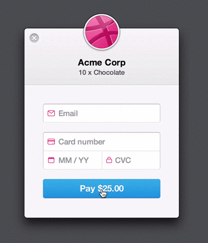

# [5-3]

# Animation and Whimsy

---

# Why animation?

---

In general, do you prefer using web apps or mobile apps?

---

### Mobile apps tend to have better "UX".

A big part of the discrepancy is around animation and interaction.

---

### Mobile apps "feel" better. They feel organic and alive

Websites often feel static and lifeless.

---

#### Reason 1: Animation is natural, and improves UX

---

#### Reason 2: Animation is a form of communication

import stripeError from "./assets/stripe-error.gif";



---

#### Reason 3: Animation is an effective way to **direct attention**.

import rainbowButtonSrc from "./assets/rainbow-button.gif";


---

#### Reason 4: Animation can be a secret weapon 🗡

- As soon-to-be-jobseekers, your side projects + portfolio website will be the main thing companies will judge you on.
- Tasteful use of animation can make your work stand out.

---

### CSS Transitions

---

### Refresher

```css
.some-class {
  opacity: 0;
  transition: opacity 500ms;
}
```

---

```jsx live=true split=[80,20]
const Demo = () => {
  const [toggled, setToggled] = React.useState(false);

  return (
    <>
      Click me:
      <animated.button
        style={{
          background: "red",
          width: 50,
          height: 50,
          transform: toggled ? "translateY(200px)" : "translateY(0px)",
          transition: "transform 500ms",
        }}
        onClick={() => {
          setToggled(!toggled);
        }}
      />
    </>
  );
};

render(<Demo />);
```

---

### Exercises

Produce the following animations

---

https://codesandbox.io/s/floral-dream-d517n

```jsx live=true split=[60,40]
//  Protip: https://cubic-bezier.com/

const App = ({ children = "Hello" }) => {
  return (
    <Button>
      <Surface>{children}</Surface>
      <Shadow />
    </Button>
  );
};

render(<Demos.AnimationEx2 />);
// render(<App />)

const Button = styled.button`
  position: relative;
  width: 300px;
  height: 80px;
  background: transparent;
  border: none;
`;

const ButtonLayer = styled.div`
  position: absolute;
  width: 100%;
  height: 100%;
  top: 0;
  left: 0;
  border-radius: 4px;
`;

const Surface = styled(ButtonLayer)`
  z-index: 2;
  background: hotpink;
  color: white;
  text-shadow: 1px 1px 2px mediumvioletred;
  display: flex;
  justify-content: center;
  align-items: center;
  font-size: 32px;
`;

const Shadow = styled(ButtonLayer)`
  position: absolute;
  z-index: 1;
  width: 100%;
  height: 100%;
  border-radius: 4px;
  background: #ccc;
`;
```

---

https://codesandbox.io/s/beautiful-ishizaka-c48ho?file=/src/App.js

```jsx live=true split=[80,20]
const App = () => {
  const [on, setOn] = React.useState(false);

  return (
    <>
      <BulbWrapper>
        <Gloss />
        <On style={{ opacity: on ? 1 : 0 }} />
        <Off />
      </BulbWrapper>
      <button onClick={() => setOn(!on)}>Turn {on ? "off" : "on"}</button>
    </>
  );
};

// Swap the two comments when you're ready to test yours.
render(<Demos.AnimationEx1 />);
// render(<App />)

const BulbWrapper = styled.div`
  position: relative;
  width: 100px;
  height: 100px;
`;

const Bulb = styled.div`
  position: absolute;
  width: 100%;
  height: 100%;
  border-radius: 50%;
`;

const On = styled(Bulb)`
  z-index: 1;
  background: linear-gradient(180deg, #ffea00, #ffb200);
  box-shadow: 0px 5px 25px hsla(42deg, 100%, 50%, 0.8);
  transition: opacity 450ms;
`;

const Off = styled(Bulb)`
  z-index: 1;
  background: #ccc;
`;

const Gloss = styled.div`
  position: absolute;
  z-index: 2;
  top: 10%;
  left: 0;
  right: 0;
  width: 65%;
  height: 40%;
  margin: auto;
  border-radius: 50%;
  background: linear-gradient(
    180deg,
    hsla(0, 0%, 100%, 0.5),
    hsla(0, 0%, 100%, 0) 75%
  );
`;
```

---

Are these animations good or bad?

---

### It depends!

- If _every_ button did the shadow lift effect, it might get kind of annoying.
- If _very important_ buttons do it, it's a good way to raise their significance.

---

### React Spring

- Uses physics to produce really nice easing
- Runs in JS instead of through CSS
- Graceful interrupts

---

### Fancy demos

https://codesandbox.io/embed/j0y0vpz59

https://codesandbox.io/embed/01p1kxymow

---

### Simple demo

import SpringDemo from "./SpringDemo";

<SpringDemo />

---

### How to use

```js
import { useSpring, animated } from "react-spring";

const Demo = () => {
  const [toggled, setToggled] = React.useState(false);

  const style = useSpring({
    transform: toggled ? "translateY(200px)" : "translateY(0px)",
  });

  return <animated.button style={style} onClick={() => setToggled(!toggled)} />;
};
```

---

```js live=true
const Demo = () => {
  const [toggled, setToggled] = React.useState(false);

  const style = useSpring({
    transform: toggled ? "translateY(200px)" : "translateY(0px)",
  });

  return (
    <>
      <animated.button
        style={{
          background: "red",
          width: 50,
          height: 50,
          ...style,
        }}
        onClick={() => setToggled(!toggled)}
      />
    </>
  );
};

render(<Demo />);
```

---

- `useSpring` returns an object full of special objects.
- `animated.div` is a `div` that knows how to use that special object.

---

### Passing a config

```js live=true split=[80,20]
const Demo = () => {
  const [toggled, setToggled] = React.useState(false);

  const style = useSpring({
    transform: toggled ? "translateY(200px)" : "translateY(0px)",
    config: {
      tension: 200,
      friction: 1,
    },
  });

  return (
    <>
      <animated.button
        style={{
          background: "red",
          width: 50,
          height: 50,
          ...style,
        }}
        onClick={() => setToggled(!toggled)}
      />
    </>
  );
};

render(<Demo />);
```

---

### Tools to come up with settings:

https://react-spring-visualizer.com/

https://chenglou.github.io/react-motion/demos/demo5-spring-parameters-chooser/

---

# Exercises

Animate the following demos!

---

https://codesandbox.io/s/kind-hooks-9iejq

```js live=true split=[70,30]
// Make the red square "inflate" more "naturally"
const App = () => {
  const [inflatedAmount, setInflatedAmount] = React.useState(1);

  const inflateMore = () => {
    setInflatedAmount(inflatedAmount + 0.55);
  };

  return (
    <Wrapper>
      <Button onClick={inflateMore}>Inflate!</Button>
      <Box
        style={{
          transform: `scale(${inflatedAmount})`,
        }}
      >
        Inflated!
      </Box>
    </Wrapper>
  );
};

const Wrapper = styled.div`
  display: flex;
  justify-content: center;
  align-items: center;
  height: 100vh;
`;
const Button = styled.button`
  position: absolute;
  top: 10px;
  left: 10px;
  z-index: 1;
`;
const Box = styled.div`
  width: 100px;
  height: 100px;
  display: flex;
  justify-content: center;
  align-items: center;
  background: red;
  font-size: 14px;
`;

render(<App />);
```

---

https://codesandbox.io/s/distracted-feistel-jm81y

```js live=true split=[70,30]
const Card = ({ isVisible, children }) => {
  return (
    <CardWrapper
      style={{
        opacity: isVisible ? 1 : 0,
        transform: isVisible ? "translateY(0px)" : "translateY(10px)",
      }}
    >
      {children}
    </CardWrapper>
  );
};

const CardWrapper = styled.div`
  box-shadow: 3px 3px 6px black;
  border-radius: 10px;
  padding: 50px;
`;

const App = () => {
  const [showCard, setShowCard] = React.useState(true);

  return (
    <Wrapper>
      <Button>Show Card</Button>
      <Card isVisible={showCard}>Hello World</Card>
    </Wrapper>
  );
};

const Wrapper = styled.div`
  text-align: center;
  margin-top: 60px;
  width: 260px;
`;

const Button = styled.button`
  position: absolute;
  top: 10px;
  left: 10px;
`;

render(<App />);
```

---
