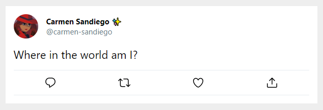

# Exercise 1: Setting up Context

Currently, the app is not set up to make use of context. Let's set up `TweetContext` and migrate the current tweet data to the provider.

The tweet content is being passed as `props` to the Tweet component. We need to move it all to the provider.

```js
<Tweet
  tweetContents="Where in the world am I?"
  displayName="Carmen Sandiego ✨"
  username="carmen-sandiego"
  avatarSrc={avatar}
  isRetweetedByCurrentUser={false}
  isLikedByCurrentUser={false}
/>
```

## Steps

1. Create a file called `TweetContext.js`.
2. Declare a variable called `TweetContext` and a component called `TweetProvider`.
3. Move the tweet data to the that provider and make it available to the App via the `value` attribute.
4. Modify `App.js` to make the context available to the entire app.
5. Modify `Tweet.js` and any child components that need to pull the data from `TweetContext`.

**HINT:** We'll consider this data to be immutable (doesn't change) for now. So there is no need to use state yet. We just want all of the data to originate in the Context and be available to the entire app.

_If you're stuck here, feel free to look back at examples/exercises from today's lecture._

Once this step is complete, the tweet should look the same as when we started.


