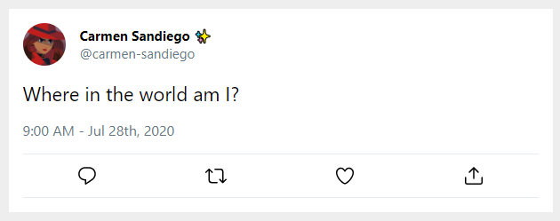

# Exercise 2: Adding the date

There is no date in the tweet.

1. In `TweetContext.js` declare a new variable called `date` and assign it a `Date` object:

```js
const date = new Date();
```

2. Add the date to the provider.
3. Retrieve it in `Tweet`
4. Take a look at the styled components inside of `Tweet`, there is a component called `Timestamp` that is not being used. Use it to render the date below the tweet content (see the original screenshot, if you're not sure where it goes.)

Once you've done all that, you'll quickly realize that we broke the app!

```
Uncaught Error: Objects are not valid as a React child
```

This happened because `new Date()` creates a date _object_ and we need to pass the actual date along as a string.

Take a look at the [momentjs documentation](https://momentjs.com/). It's already been added as a project dependency. (You can confirm this by looking at the `package.json`).

5. Follow the documentation on how to setup moment.
6. You can replace `new Date()` with the proper `moment` syntax to get the date to render exactly like the screenshot below.


