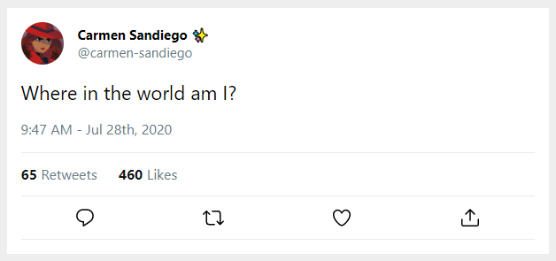

# Exercise 3: Adding mutable data to state

We need to know the # of likes, # of retweets. We also need to know if the current user has liked and/or retweeted the tweet.

1. Inside of `TweetContext.js` set up `state` for the following:

- `numOfLikes` (initial value of 460)
- `numOfRetweets` (initial value of 65)
- `isLiked` (initial value of `false`)
- `isRetweeted` (initial value of `false`)

2. Pass `numOfLikes` and `numOfRetweets` to the provider.
3. Update `isRetweetedByCurrentUser` and `isLikedByCurrentUser` to make use of the `isRetweeted` and `isLiked` flag.
4. Add the the missing values to `Tweet`. There is a styled-component called `Stats` that is not used. Use it to render the stats below the date.
5. Update the styling to match the screenshot below.

**HINT:** It would be a good idea to create a new component called `Stat.js` and use it to render the individual stats.

