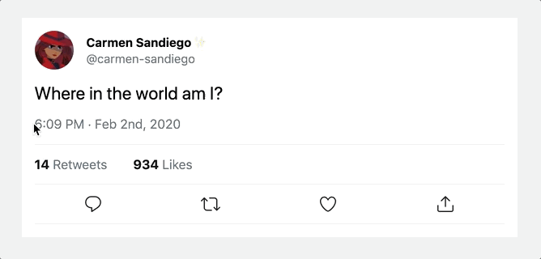

# Exercise 4: Adding "Like" and "Retweet" functionality

## The "Like" Button

When the user clicks the "Like" button, two things should happen:

- We should set `isLiked` from `false` to `true`
- We should increment the `numOfLikes` by 1

If the tweet is _already_ liked, the opposite should happen. And the same things should be true for retweets as well.

If you look at the `LikeButton` component, you'll notice that it already takes an `isLiked` prop, and passes it along to the `Heart` component. This needs to be rewired to use context. \_Do this in `LikeButton` to not have to modify `Heart`.

Once you've successfully passed `isLiked`, we need to create a new function called `handleToggleLike` inside of `TweetContext`. This function will be responsible for changing the value of `isLiked` and incrementing/decrementing the `numOfLikes`.

**HINT:** You will need to add this function as an `onClick` to the proper `Action` item in `ActionBar.js`...

## The Retweet Button

Repeat the process above for the retweet button.

By the end of this first exercise, you should have something that looks like this, and can handle toggling the like/retweet buttons on/off:

