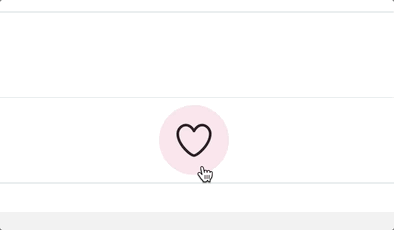
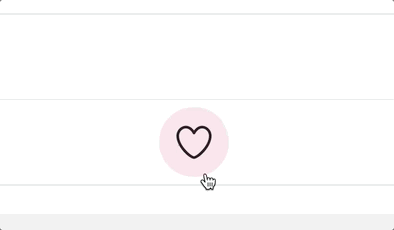

# Exercise 5: Popping the circle

The first part of the exercise we should tackle is the popping circle. For this, we'll use a **keyframe animation**.

Here's the effect we're going for, isolated:



Create a new `PoppingCircle` file inside of the `LikeButton`

Inside `PoppingCircle`, create a new component. It should take two props:

- `size`
- `color`

Inside `LikeButton.js`, import this new `PoppingCircle` component, and render it conditionally:

```js
isLikedByCurrentUser && <PoppingCircle size={size} color="#E790F7" />;
```

We only want to render the `PoppingCircle` when the tweet is liked; the animation shows briefly when the user clicks the like button, but only when they're liking it; there is no animation when unliking.

Keyframe animations occur immediately on mount. We can leverage this by unmounting it when the tweet isn't liked. That way, the animation retriggers whenever the tweet is re-liked, since the component will be re-mounted every time.

As a reminder, this is what the keyframes syntax looks like with styled-components:

```jsx
import styled, { keyframes } from "styled-components";

const turnBlue = keyframes`
  from {
    color: inherit;
  }
  to {
    color: blue;
  }
`;

const Wrapper = styled.div`
  animation: ${turnBlue} 500ms;
`;
```

See if you can figure out which properties need to change to enable the animation shown in the GIF above =)

**HINT:** This animation features a change in size, as well as visibility. Remember that whenever possible, for performance reasons, we only want to animate `transform` and `opacity`, and it is possible to perform this effect with these 2 properties!

**HINT:** If the heart is hidden _behind_ the popping circle, you can use z-indices to put the heart behind the popping circle!

**HINT:** If you notice that you're left seeing a big pink circle after the animation completes, you can add the `forwards` keyword, like so:

```js
const Wrapper = styled.div`
  animation: ${someKeyframeAnimation} 500ms forwards;
`;
```

`forwards` means that it will _persist_ whatever settings the keyframe animation ended on. It keeps those values going _forward_ in time. Without this keyword, the properties disappear the moment the animation completes.

**HINT:** You can play with the easing to make it feel "poppier". Use https://cubic-bezier.com/ to come up with a nice curve.

**HINT:** You may notice that the circle disappears too early:



In this GIF, the animation is transitioning the right properties, but it disappears so quickly that it's hard to tell!

If you want to animate different properties at different speeds, you can use _multiple keyframe animations_:

```js
const scale = keyframes`
  from {
    some-property: 0;
  }
  to {
    some-property: 1;
  }
`;

const fade = keyframes`
  from {
    some-other-property: hi;
  }
  to {
    some-other-property: bye;
  }
`;

const Wrapper = styled.div`
  animation: ${scale} 300ms forwards, ${fade} 500ms forwards;
`;
```

Notice how each keyframe animation is given a different speed: `scale` is over 300ms, `fade` is over 500ms. This way the fade-out happens slower than the scaling animation.
