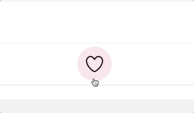

# Exercise 6: Swelling heart

The next step in our animation: A springy, swelling heart:



Create a new component inside of the `LikeButton` folder, `ScaleIn`. This component should only take 1 prop, `children`. The idea is that we'll be able to use this component on _anything_ we want to scale in:

```js
// Examples of how we COULD use this component,
// although we'll only use it in 1 way in this workshop:

<ScaleIn>
  
</ScaleIn>

<ScaleIn>
  <Banner>
    Limited time sale!!
  </Banner>
</ScaleIn>
```

Inside our `LikeButton` component, we can wrap the `<Heart>` component we have in this new `ScaleIn` component, _if_ the Tweet is liked:

```js
<Wrapper>
  {/* Conditionally wrap the heart */}
  {isLikedByCurrentUser ? (
    <ScaleIn>
      <Heart width={heartSize} isToggled={isLikedByCurrentUser} />
    </ScaleIn>
  ) : (
    <Heart width={heartSize} isToggled={isLikedByCurrentUser} />
  )}
</Wrapper>
```

Because the animation is springy, we'll use **React Spring** to accomplish it.

Start by installing the dependency with Yarn:

```bash
yarn add react-spring
```

Because we want the animation to happen on-mount, we'll make use of the `from` prop.

Here's an example of how React Spring works. See if you can work out how to transform this example into the effect you want:

```js
import { useSpring, animated } from "react-spring";

const SomeComponent = () => {
  const style = useSpring({
    opacity: 1,
    from: {
      opacity: 0,
    },
    config: {
      tension: 1000,
      friction: 1,
    },
  });

  return <animated.div style={style}>Boing</animated.div>;
};
```

**HINT:** Play around with `tension` and `friction` to get the right "springy" feel. You can use the following tools to find the right values:

**HINT:** You will definitely have to tweak the css to get it to work properly. (esp. `position`ing of various elements.)

**HINT:** You can add regulat css to the `useSpring` object.

- https://chenglou.github.io/react-motion/demos/demo5-spring-parameters-chooser/
- https://react-spring-visualizer.com/

> 🆘 **If you are stuck, or want to compare, you can look at this [hint](./_hints/hint-1.md).**
