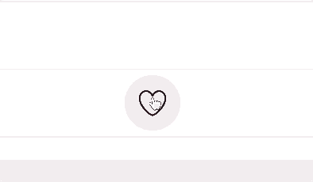
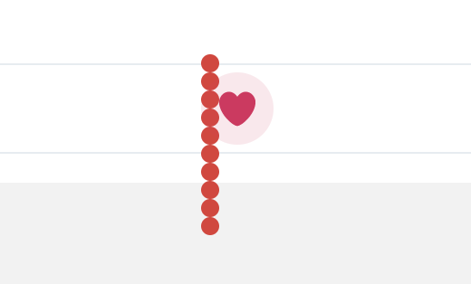
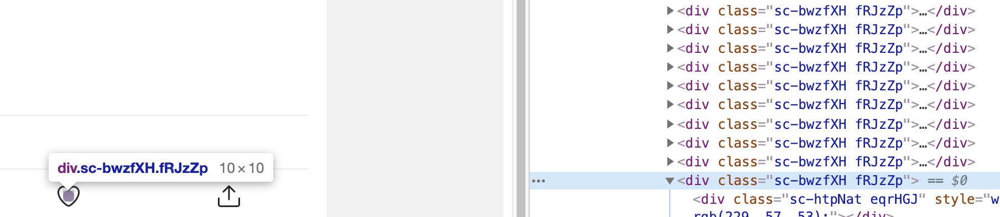
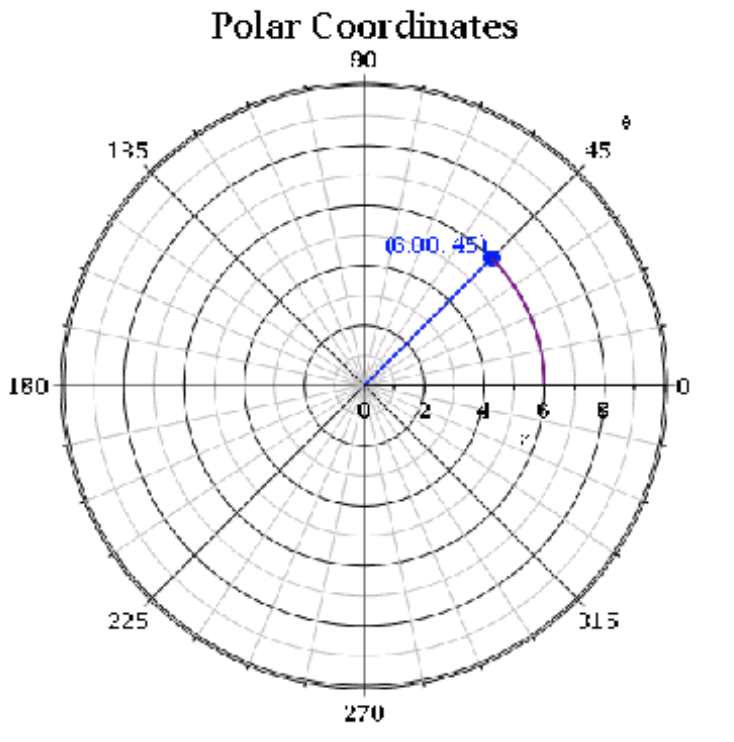
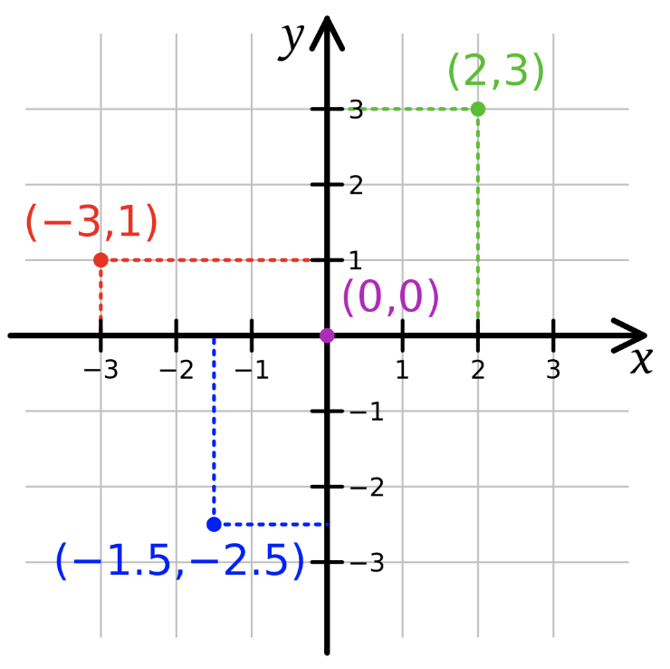

# Exercise 8: Throwing the Particles ✨

Finally, the last part of this animation is the colorful, circular pieces of confetti that pop out of the heart:


There's a few things to notice about this:

- The pieces all move at different angles (away from the center)
- The pieces are randomly-colored
- The pieces have a random distance (some clear the pink circle, but not many)
- There's two "bursts", one early one and one later one.

We'll eventually create something that meets all these conditions, but for now, let's start a bit simpler. Let's aim to create this:



In this first example, every particle is uniform in everything except "angle".

Create two new components:

- Particle
- ConfettiPiece

Here's the breakdown of responsibilities:

- `Particle` is agnostic as to its contents. It takes a `distance` and an `angle` and it will move its `children` according to those values. It's like the `ScaleIn` component we built earlier: It can move anything around.
- `ConfettiPiece` will handle all of the stuff specific to the circles popping out of the heart: it will control positioning, as well as the UI itself.

Inside `LikeButton`, we want to render a bunch of confetti pieces. We can make use of the `range` utility in `src/utils` to render many copies:

```js
<Wrapper>
  {/* Other stuff ✂️ */}
  {range(12).map((i) => (
    <ConfettiPiece key={i} />
  ))}
</Wrapper>
```

Inside `ConfettiPiece`, let's return a red circle, 10px by 10px

> You can create a circle with a `<div>`, `background-color`, and `border-radius`!

We want to solve a problem right off the bat; we want every particle to start in the very center of the heart. If we aren't careful, we'll wind up with a bunch of circles in a line:



So inside `ConfettiPiece`, create a styled wrapper, `CenteredWithinParent`. Your first task is to ensure that every red circle sits stacked one on top of the other, right in the center:



Let's add a few props to `ConfettiPiece`, and render it conditionally, based on whether the tweet is liked:

```js
<Wrapper>
  {/* Other stuff ✂️ */}
  {isLikedByCurrentUser &&
    range(12).map((i) => (
      <ConfettiPiece
        key={i}
        angle={360 * (i / 12)}
        distance={20}
        color={PARTICLE_COLORS[0]}
      />
    ))}
</Wrapper>
```

The value for `angle` ensures that the 12 pieces will be evenly spaced across the 360 degrees in a circle.

`distance` will be the # of pixels each particle moves, in the direction specified by the `angle`.

This file came pre-loaded with `PARTICLE_COLORS`, an array of hex color codes, For now, each particle will inherit the first color in the array, which is red.

Our job now is to put `Particle` to work. Let's wrap it around the red circle we created:

```js
// inside ConfettiPiece.js
<CenteredInsideParent>
  <Particle angle={angle} distance={distance}>
    <Circle />
  </Particle>
</CenteredInsideParent>
```

Inside `Particle`, it's time to do some 🎉 trigonometry 🎊.

As a refresher, the thing we need to do is convert between _polar coordinates_ to _cartesian coordinates_.

Polar coordinates are based on a _direction_ and a _distance_. This tends to be easier for humans to think about, in terms of spreading things out evenly.



Cartesian coordinates are the X/Y values we always deal with in Javascript.



Inside `Particle`, we need to convert polar to cartesian. The trigonometry isn't the most exciting thing in the world, so here's the formulas you'll need to convert from one to the other:

```js
const convertDegreesToRadians = (angle) => (angle * Math.PI) / 180;

const angleInRads = convertDegreesToRadians(angle);

const x = Math.cos(angleInRads) * distance;
const y = Math.sin(angleInRads) * distance;
```

Also inside `Particle`, we want to do the animating from start to finish. It's up to you whether you want to use a keyframe animation, or React Spring! Both are reasonable approaches.

At this point, you should see the particles all transitioning from A to B, albeit in lockstep:


Next, let's add some variety! And this part is left mostly up to you, with some hints.

**NOTE:** Don't feel like you need it to look _exactly_ like the GIF! Feel free to do as much or as little as you want here, and don't be afraid to try something different. **You will not be graded based on how similar your solution is to the provided example**. As long as you have animated confetti, you've met the objective; have fun with it!

The next exercise, Exercise 5, is super important, so don't neglect it!

_HINT:_ you can use `sample` in `src/utils` to get a random color for each ConfettiPiece

_HINT:_ React Spring takes a `delay` option. You can use this to create a "two-stage" burst, by delaying half of the particles by a couple hundred milliseconds. The same option is possible with keyframe animations.

_HINT:_ Pick random values (within a reasonable range) for distance. You can use the `random` helper function in `src/utils`

_HINT:_ By default, the particles all start in the very center of the heart. It might be better for them to start a little further out from the center. What if you repeated the calculation to turn angle/distance into X/Y, but gave a much smaller value for the initial distance?
